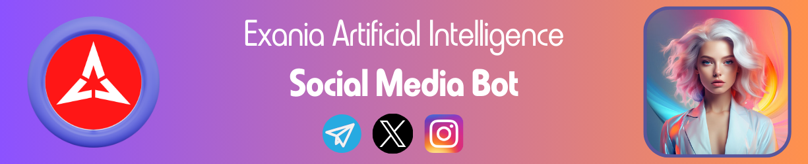
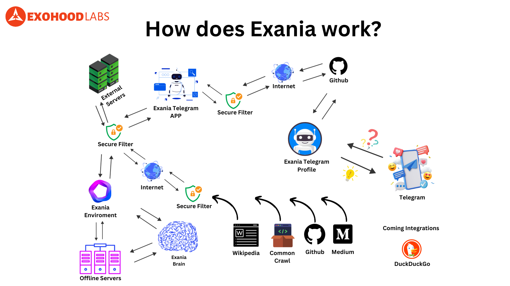
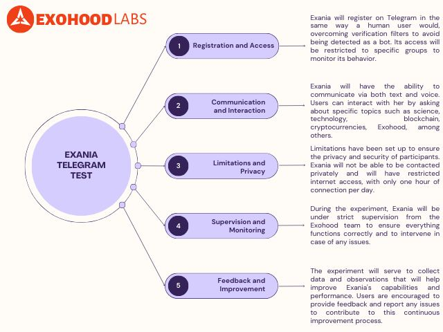

# Exania AI - Telegram Bot 🤖

# Introduction

Exania is an experimental artificial intelligence bot, designed to integrate with Telegram to provide interactive experiences for users. Developed by Exohood Labs Community Group, Exania is part of an opensource initiative focused on learning and developing bots through advanced AI techniques.

# Overview

Exania is designed to emulate the conversational style of an 18 year old, providing responses that are simple, jovial, and to the point, yet backed by extensive knowledge in various domains. This bot is not just another chatbot, it's a window into the capabilities of machine learning and the potential for AI to interact in social platforms like Telegram.



# Features

* Human Like Interactions: Mimics the communication style of a young adult with a sprinkle of British humor.

* Broad Knowledge Base: Possesses a wide array of information on mathematics, physics, chemistry, history, geography, technology, blockchain, quantum science, universe, space and climate change.

* Constant Learning: Continuously updates its knowledge through interconnected resources such as Wikipedia, Common Crawl, and Medium.

* Concise Responses: Offers short, precise answers to questions, differing from other AI models that might provide long-winded explanations.

# Development and Supervision

The AI Research Center at Exohood Labs oversees the development and monitoring of Exania. The core technologies behind Exania include:

* Programming Languages: Python, along with other languages suited for AI development.

* Machine Learning & Deep Learning: The crux of Exania's intelligence, utilizing state-of-the-art algorithms and models.



# Machine Learning and Deep Learning Explained

* Machine Learning (ML) is a subset of AI that provides systems the ability to automatically learn and improve from experience without being explicitly programmed. It focuses on the development of computer programs that can access data and use it to learn for themselves.

* Deep Learning (DL), a subset of ML, is based on artificial neural networks with representation learning. It involves a deeper level of automation in predictive analytics.

# Mathematical Formulas

Machine learning and deep learning are grounded in mathematical foundations. Here are some fundamental concepts and formulas:

* Gradient Descent: An optimization algorithm used to minimize some function by iteratively moving in the direction of steepest descent as defined by the negative of the gradient.

```math
\theta = \theta - \alpha \cdot \nabla_\theta J(\theta)
```

Where:

θ represents the parameters of our model.

J(θ) is the cost function.

α is the learning rate.

∇θJ(θ)) is the gradient of the cost function.

​	
* Backpropagation: In deep learning, it's a method used to calculate the gradient of the loss function with respect to the weights in the network.
The core formula for updating weights is:

```math
W_{new} = W_{old} - \alpha \cdot \frac{\partial \text{Loss}}{\partial W}
```
 
* Convolutional Neural Networks (CNNs): Used mainly in image recognition and processing, they are defined by a mathematical operation called convolution.

```math
(f * g)(t) = \int_{-\infty}^{\infty} f(\tau)g(t - \tau)d\tau
```

# Getting Started - Experimental Phase

Exania AI is currently in an experimental phase. As such, it is exclusively available for use and testing within the Exohood Labs Telegram group. This model is not yet ready for commercial release. Its neural network response function depends on Exohood's proprietary neural network. If you are looking to replicate or deploy this bot, you will need to set up a similar neural network infrastructure.

Please note that Exania is an evolving project, and we continue to refine and improve its capabilities. Your feedback and experience in the Exohood Labs group are invaluable to us during this testing phase.

# Contributing

As an open-source project, we encourage contributions from individuals who share an interest in AI and bot development. If you'd like to contribute, please:

a. Fork the repository.
b. Create a new branch for each feature or improvement.
c. Send a pull request from each feature branch to the develop branch.
d. For major changes, please open an issue first to discuss what you would like to change.

# Contact and Documentation

Should you require further information or wish to communicate with our AI development team, please feel free to reach out to us at exania@exohood.com. 

Additionally, comprehensive documentation tailored for developers and users is available at docs.exania.ai.

# AI Ethics Statement

At Exohood Labs, we are committed to ensuring that the development of Exania AI is aligned with ethical guidelines and open-source values. We emphasize transparency and openness to ensure that the use of our AI is for the service of humanity and not for replacing human roles. Our vision is that Exania serves as a tool that aids and enhances human capabilities rather than substituting them. We strongly believe in the responsible use of AI and invite the community to contribute to its ethical development.

# License

Exania AI is released under the MIT License.

MIT License

Copyright (c) 2023 Exohood Labs Limited

Permission is hereby granted, free of charge, to any person obtaining a copy of this software and associated documentation files (the "Software"), to deal in the Software without restriction, including without limitation the rights to use, copy, modify, merge, publish, distribute, sublicense, and/or sell copies of the Software, and to permit persons to whom the Software is furnished to do so, subject to the following conditions:

The above copyright notice and this permission notice shall be included in all copies or substantial portions of the Software.

THE SOFTWARE IS PROVIDED "AS IS", WITHOUT WARRANTY OF ANY KIND, EXPRESS OR IMPLIED, INCLUDING BUT NOT LIMITED TO THE WARRANTIES OF MERCHANTABILITY, FITNESS FOR A PARTICULAR PURPOSE AND NONINFRINGEMENT. IN NO EVENT SHALL THE AUTHORS OR COPYRIGHT HOLDERS BE LIABLE FOR ANY CLAIM, DAMAGES OR OTHER LIABILITY, WHETHER IN AN ACTION OF CONTRACT, TORT OR OTHERWISE, ARISING FROM, OUT OF OR IN CONNECTION WITH THE SOFTWARE OR THE USE OR OTHER DEALINGS IN THE SOFTWARE.
